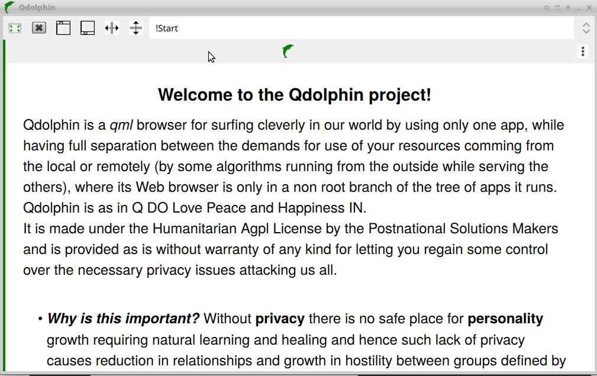

# Qdolphin

Qdolphin is a qml browser developed in [qt framework](https://www.qt.io/download-qt-installer) for pwa ux (progressive web app user experience), with its currently QtWebEngine browser configured by qml and granted under the [Humanitarian Agpl License](http://namzezam.wikidot.com/humanitarian-agpl-license).

*Before running the Dolphin please extract the [qrc](https://github.com/comcomist/Qdolphin/blob/master/qrc.206.zip?raw=true) file into the build directory [binary 64 linux](https://github.com/comcomist/Qdolphin/blob/master/Qdolphin?raw=true)
.* (use this for [andorid](https://doc.qt.io/qt-5/android-getting-started.html))

### Welcome to the Qdolphin project! 

Qdolphin is a qml browser for surfing cleverly in our world by using only one app, while having full separation between the demands for use of your resources comming from the local or remotely (by some algorithms running from the outside while serving the others), where its Web browser is only in a non root branch of the tree of apps it runs and it includs the encryption feature of 3fish1kbit in ctr mode by contextaul kdf2 key, producing 4k files each having different strong key strensening the weakest ring of any security chain being the human passcode.

Qdolphin is as in Q DO Love Peace and Happiness IN.

**The concept** is simple:  While starting from the client and not the server, when you develop for the users you care for, encrypt first in the user's devices and seprat the resuosers demands comming from local or the remote. See this **[use Case](http://buildup1.wikidot.com/)** It is made under the Humanitarian Agpl License by the **[Postnational Solutions Makers](http://comcomist.wikidot.com/)** and is provided as is without warranty of any kind for letting you regain some control over the necessary privacy issues attacking us all.

**Why is this important?** Without privacy there is no safe place for personality growth requiring natural learning and healing and hence such lack of privacy causes reduction in relationships and growth in hostility between groups defined by any kind of identity politics!

**API:** Press Enter to start. When traversing, by up/down+Alt, in your directories tree, press Enter to activate an item or click green for qml directory, blue for web or secert for encryption feature (of 3fish1kbit in ctr mode by contextaul kdf2 key, producing 4k files each having different strong key strensening the weakest ring of any security chain being the human passcode). The Qdolphin is a browser developed in qt framework for pwa ux (progressive web app user experience), with its currently QtWebEngine browser configured by qml. Its qml applications are added as plugins (using .qml files in 'qrc/import' in the build directory and .h files in 'import' in the working directory ), while being separated in memory, performed natively and set by the Qobject hierarchy (with 0.156kb overhead).

**Premise:** Our world is governed by evil thinking people, as Alexander Nix of Cmbridge Analytica, hacking 200 election campaigns and as in NSO Group, developing cyber intelligence to be used by the darkest governments for controlling and isolating their travelers, residents and citizens, while acting in the somewhat smart industry monopolized by few as the 5 FAAMG ( Facebook, Amazon, Apple, Microsoft, and Google), making users be their things in their data sucker IoT (Internet Of Things), while being protected by their killers, such as drone, powered by their green energy and Ai (artificial intelligence), when controlling us all without human but by triggers of the matches between our free speech to some examples given in the laws formed by their lobbies and research institutes, to maximize the benefit of the few owners/possessors of such complexcity.
